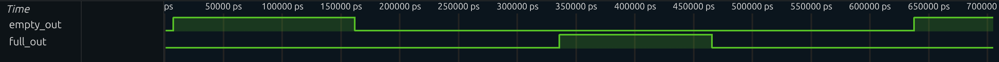

# Asynchronous FIFO with APB Interface (SystemVerilog)

## 📌 Overview

This project implements a **parameterizable asynchronous FIFO** in SystemVerilog for safe data transfer between independent clock domains. The design follows industry-standard **Clock Domain Crossing (CDC)** techniques and is verified using a **self-checking testbench with Verilator**.

The FIFO is integrated behind an **AMBA APB slave interface**, enabling processor-controlled data movement typical of SoC environments.

This project demonstrates practical digital design, CDC safety, and verification methodology used in real hardware teams.

---

## 🎯 Project Goals

- Implement a robust async FIFO using Gray-coded pointers  
- Ensure CDC safety using multi-flop synchronizers  
- Build a self-checking verification environment  
- Verify full/empty behavior under asynchronous clocks  
- Integrate an APB slave wrapper for processor access  
- Prepare the design for SoC-style integration  

---

## 🧠 Key Concepts Demonstrated

- Clock Domain Crossing (CDC)  
- Gray code pointer synchronization  
- Dual-clock FIFO architecture  
- Two-flop synchronizers  
- APB protocol integration  
- Self-checking testbench design  
- Scoreboard-based verification  
- Sticky overflow flag handling  

---

## 🧩 Block Diagram


## 📁 Repository Structure
rtl/
fifo_async.sv # Asynchronous FIFO core
sync2ff.sv # Two-flop synchronizer
apb_fifo_async.sv # APB wrapper around FIFO

tb/
tb_fifo_async.sv # FIFO self-checking testbench
tb_apb_fifo_async.sv # APB + FIFO integration testbench

docs/
waveform_example.png # Simulation waveform 

sim/
obj_dir/ # Verilator build output (generated)

## 📈 Waveform Example

Below is a representative simulation showing:

- Independent write/read clocks  
- APB write transactions  
- Correct FIFO ordering across CDC  
- Empty flag assertion at completion  




## 🔧 How to Run (Verilator)

### Build and run

```bash
verilator -Wall --binary --top-module tb_apb_fifo_async \
  rtl/sync2ff.sv \
  rtl/fifo_async.sv \
  rtl/apb_fifo_async.sv \
  tb/tb_apb_fifo_async.sv

./obj_dir/Vtb_apb_fifo_async

Alternatively you can run through the make file
make run
make waves


